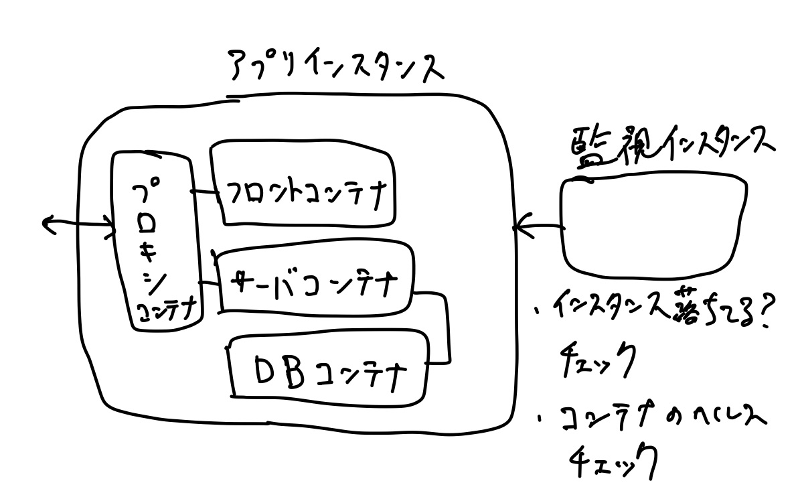

# システムアーキテクチャ

## 非機能要件

https://thinkit.co.jp/article/17647

- 可用性: ダウンタイム、落ちないようにする→CTF開始直後に落ちない
- 拡張性: 速度どれくらい欲しいか→フラグ提出して違和感ない速度でOK/NG出て欲しい
- メンテナンス: 保守や運用→監視を行いたい
- ユーザビリティ: スマホから使うか？とかUX→PCから利用のみ想定、トップページのみスマホ対応
- 効果目標: 投資に対する効果→考えない
- 法律や環境→考えない

システムに求める目標

- CTF開始直後に落ちないサーバ
- 監視を行いたい

## インフラの図



## リポジトリ構成

```text
- webclient # フロント
- scoreserver # サーバ
- monitoring # 監視
- infra # インフラ、terraform
- misc # db, proxyとか
```
